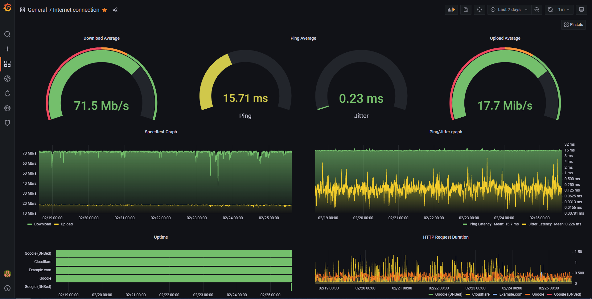
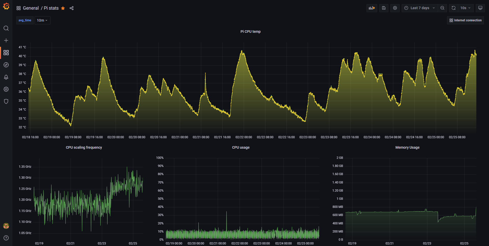

# Internet Monitoring Docker Stack with Prometheus + Grafana
## Pre-requisites

Make sure Docker and [Docker Compose](https://docs.docker.com/compose/install/) are installed on your Docker host machine.

## Quick Start

### Pull the repo

```bash
git clone https://github.com/tb942/internet-monitoring
cd internet-monitoring
```

### Create a `/grafana/config.monitoring` file

```bash
touch ./grafana/config.monitoring
```

Use this file to set your Grafana config environment variables. you can find a list of options here: [Grafana Configuration docs](https://grafana.com/docs/grafana/latest/administration/configuration/)

An example file would be:
```.env
GF_SECURITY_ADMIN_PASSWORD=<your login password>
GF_USERS_ALLOW_SIGN_UP=false
```

### Stand the stack up
```bash
docker-compose up --detach
```

Go to [http://localhost:3000/d/o9mIe_Aik/internet-connection](http://localhost:3030/d/o9mIe_Aik/internet-connection) to view the internet connection (change `localhost` to your docker host ip/name).

<center></center>

Go to [http://localhost:3000/d/I_uNS1xnk/pi-stats](http://localhost:3030/d/I_uNS1xnk/pi-stats) to view the current pi stats (change `localhost` to your docker host ip/name).

<center></center>

## Configuration

To change what hosts you ping you change the `targets` section in [/prometheus/pinghosts.yaml](./prometheus/pinghosts.yaml) file.

For speedtest the only relevant configuration is how often you want the check to happen. *It is at 10 minutes by default which might be too much if you have limit on downloads*. This is changed by editing `scrape_interval` under `speedtest` in [/prometheus/prometheus.yml](./prometheus/prometheus.yml).

Once configurations are done, run the following command:
```bash
docker-compose up --detach
```

That's it. docker-compose builds the entire Grafana and Prometheus stack automagically.

The Grafana Dashboard is now accessible via: `http://<Host IP Address>:3000` for example http://localhost:3000

username - `admin`

password - `<your login password>` (Password you set in the `/grafana/config.monitoring` env file)

The DataSource and Dashboard for Grafana are automatically provisioned.

## Updating
```bash
docker-compose pull
docker-compose up --detach
```